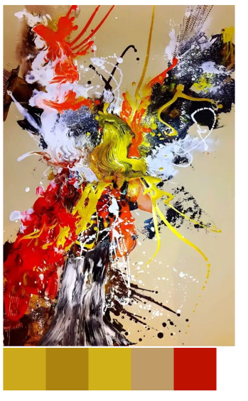

# Color-Palette-Extractor
### ⚠️ Disclaimer - Developed for a school project - Module will not be maintained

## Description
Color-Palette-Extractor is a lightweight module that extracts colors from images frm a provided URL. The extracted colors are clumped together in a palette. The palette can be customized to extract more specific colors such as bright, dark or muted. 
THis module is supposed to work in a browser environment with DOM access.


- Enter a image URL, extract the pixels and generate color palettes in various styles.


## Installation
 > $ npm install color-palette-extractor
  

 ## Dependencies
 Color Palette Extractor is an ES6 module and is not compatible with ES5 environments.
 It must also run in a browser environment to have access to the DOM to create Image and Canvas elements.

## Usage examples

```javascript
  import { colorPaletteExtractor } from "color-palette-extractor"

  const paletteExtractor = new ColorPaletteExtractor()

  const image = paletteExtractor.loadImage('image.jpg')
  const pixels = await image.getPixels()
  
  // Specify pixel data and number of colors
  const palette = paletteExtractor.startExtraction(pixels, 10)

  // Returns array of objects
  // [ {red green blue} ]
  const extraxtedPalette = palette.getPalette()
```
To get diffent palettes you can use:

```javascript
const darkPalette = palette.getDarkPalette()
const brightPalette = palette.getBrightPalette()
const mutedPalette = palette.getMutedPalette()
```

To present the color palette you can use:

```javascript
// Get a div with the palette. Set size of each colored div
const paletteDiv = paletteExtractor.presentPalette(palette, 100)

// Present in your own html document
const body = document.querySelector('body')
body.append(paletteDiv)
```

## Example


## Known issues
- Image links can fail if the server has origin controll

## Upcoming Features
- Allow users to manually set brightness and saturation levels for palettes

## License
GNU GENERAL PUBLIC LICENSE
@Robin Pettersson 2024


